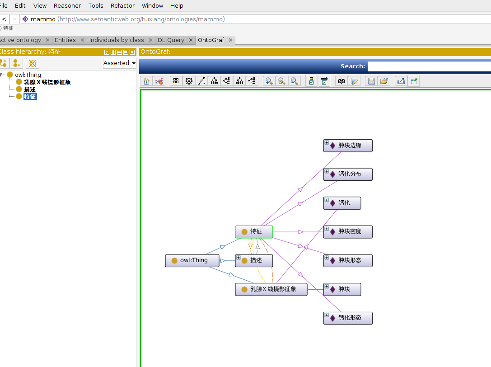
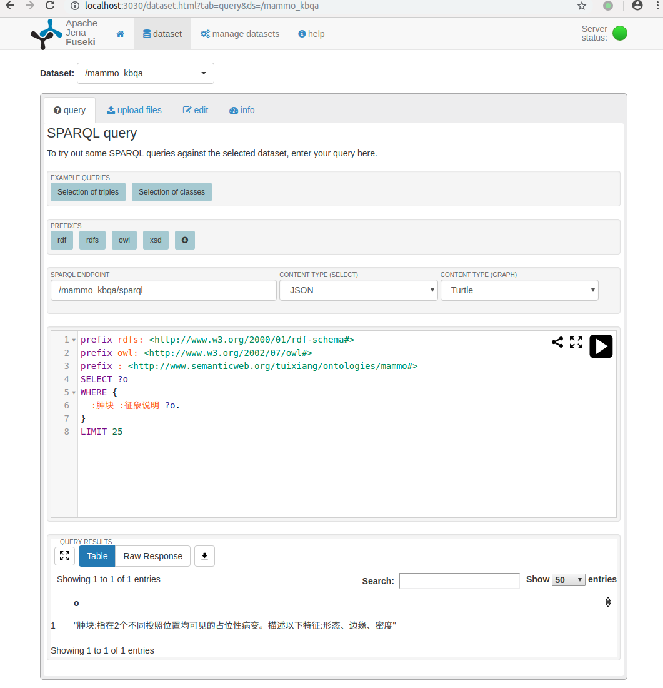
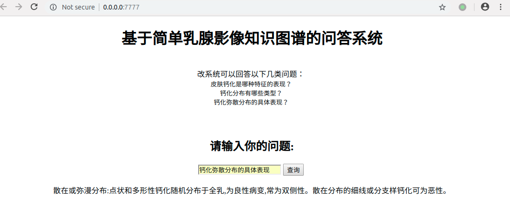

# qakg_mammo
[参考](https://github.com/zhangtao-seu/Jay_KG), 此项目实现基于乳腺影像知识图谱简单问答. 
当前运行环境:ubuntu18.04 python3.6

### 一. 准备工作:
* git clone ssh://git@code.infervision.com:2022/whuifang/qakgmammo.git
* 搭建虚拟环境([参考](https://git.infervision.com/w/%E6%89%A7%E8%A1%8C/%E7%BB%8F%E9%AA%8C/%E6%8A%80%E6%9C%AF%E7%A7%AF%E7%B4%AF/python/%E8%99%9A%E6%8B%9F%E7%8E%AF%E5%A2%83%E7%9A%84%E6%9E%84%E5%BB%BA/))
* pip install 安装包

```
pip install virtualenv
cd my_project_dir
virtualenv venv
virtualenv -p /usr/bin/python3.6 venv
source venv/bin/activate
pip install -r requirements.txt 
```

### 二. Jena与Fuseki的安装
* Jena与Fuseki的安装与使用,[参考](https://zhuanlan.zhihu.com/p/56449967)
* Jena 3.0.0后的版本需要 Java8，之后下载Jena 包和 Fuseki包, 即可完成安装.
```
wget http://mirrors.hust.edu.cn/apache/jena/binaries/apache-jena-3.10.0.tar.gz && tar -xvzf apache-jena-3.10.0.tar.gz;
wget http://mirrors.hust.edu.cn/apache/jena/binaries/apache-jena-fuseki-3.10.0.tar.gz && tar -xvzf apache-jena-fuseki-3.10.0.tar.gz;
```

### 三. 数据准备，导入图谱文件, 配置conf文件
* 由protege构建模型文件生成mammmo.owl文件(具体可参照后期文档), 也可以用protege直接打开该mammo.owl文件. protege的安装和使用可参考 [知识图谱工具 Protege的下载安装与使用](https://blog.csdn.net/u012052268/article/details/88052390).
    ```
    cd /home/tx-eva-02/software/Protege-5.5.0-linux/Protege-5.5.0
    ./run.sh
    ```
    打开后可看到图谱的结构: 

    
 
* 将owl文件导入到jena数据库中,tdbloader2导入到指定文件夹中,这里是项目文件中的tdb_mammo2.
```
cd /home/tx-eva-02/software/apache-jena-3.10.0
/tdbloader2 --loc='/media/tx-eva-02/DR/project_prediction/qakg_mammography/tdb_mammo2' '/media/tx-eva-02/DR/project_prediction/qakg_mammography/mammo.owl'
```

### 四. 启动fuseki,支持sparql查询
* 启动fuseki-sevice
    1. 修改fuseki_conf.ttl文件中的fuseki:name(命名数据库名字),tdb:location(上面生成的tdb_mammo2的路径)
    2. 
        ```
        cd /home/tx-eva-02/software/apache-jena-fuseki-3.10.0
        ./fuseki-server --config='/media/tx-eva-02/DR/project_prediction/qakg_mammography/fuseki_conf.ttl'
        ```
        --config指定fuseki_conf.ttl的路径.
* 启动之后可在 http://localhost:3030/ , 进入到Apache Jena Fuseki查询界面,支持sparql查询.见下图.


### 五. 问答程序部分
* 用到jieba分词
需要将图谱中所有实体写到KB_query/external/mammo.txt, jieba.load_userdict, 指定自己自定义的词典，以便包含 jieba 词库里没有的词。虽然 jieba 有新词识别能力，但是自行添加新词可以保证更高的正确率.词典格式和 dict.txt 一样，一个词占一行；每一行分三部分：词语、词频（可省略）、词性（可省略），用空格隔开，顺序不可颠倒。file_name 若为路径或二进制方式打开的文件，则文件必须为 UTF-8 编码。词频省略时使用自动计算的能保证分出该词的词频。

### 六. 运行
`python qa_start.py`

* 打开http://0.0.0.0:7777/ 会有问答页面.
* 其它机器访问,换成服务器ip, 如http://192.168.110.2:7777/
